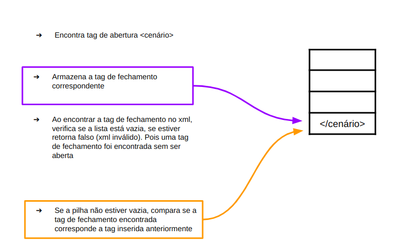
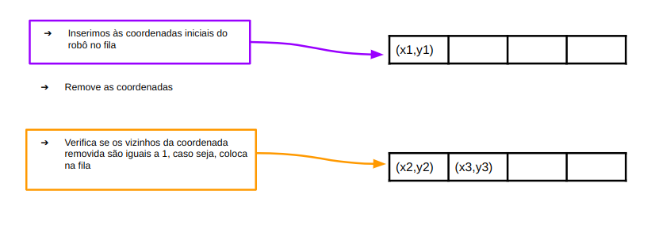
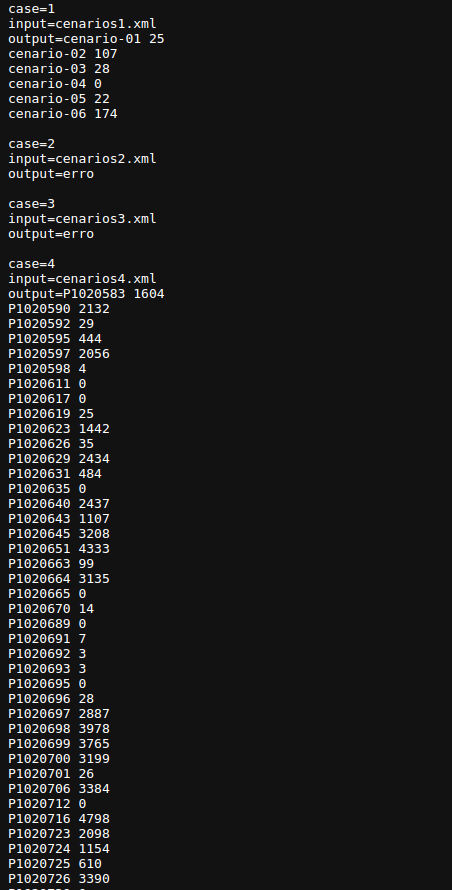
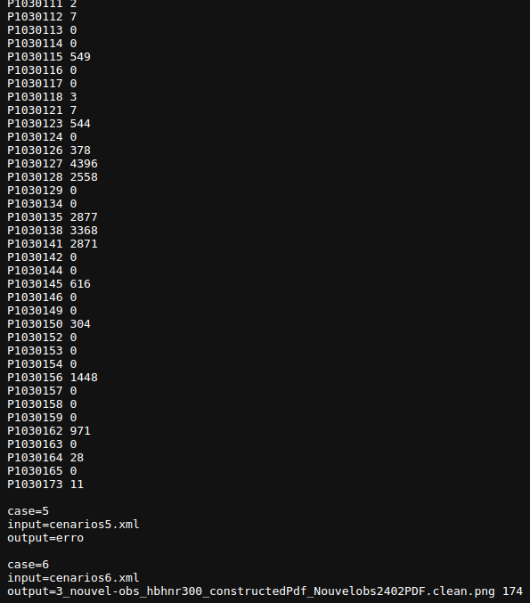
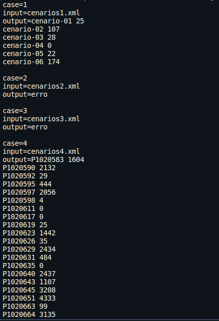
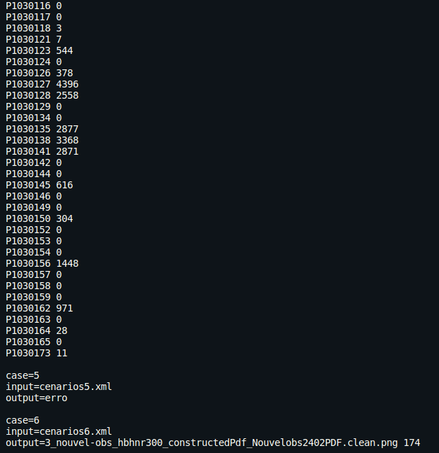

<div style="text-align: center;">
  <h2>Trabalho 01 | Estrutura de dados - INE5408</h2>
</div>

**Alunos**: Eduardo Achar - 23102448
Victória Rodrigues Veloso - 23100460 

---

# 1. Resumo

O trabalho proposto tem como finalidade a validação de arquivos cenarios.xml e o cálculo da área em que um robô pode passar, sendo que esta área é definida por uma matriz de 'zeros' (não pode passar) e 'uns' (pode passar). 
<<<<<<< HEAD
=======
O código inicia abrindo o arquivo xml e percorrendo todos os seus caracteres até encontrar a primeira tag de abertura. Em seguida, o nome da tag é armazenado em "tag" e, até que o caracter ">" de fechamento seja encontrado.

>>>>>>> origin/main

# 2. Organização dos arquivos

- `area.cpp`: Calcula a área total por onde o robô passa (atividade 2)
- `array_queue.cpp`: Define a nossa estrutura de fila (Código feito em sala durantes as aulas de lab)
- `array_stack.cpp`: Define a nossa estrutura de pilha (Código previamente disponibilizado pelo professor)
- `func.h`: Arquivo header das funções definidas em seus respectivos arquivos
- `main.cpp`: Declaração da main e utilização da info para cada arquivo (adaptado para cada SO) além dos tratamentos de entrada e saída
- `validation.cpp`: Valida o XML recebido (atividade 1)
- `infos.cpp`:Retira as informações (posição inicial, matriz, nome...) para unir a validação com o cálculo de área

<<<<<<< HEAD
Consideração: como não estávamos conseguindo enviar os arquivos através do VPL na estrutura descrita acima, os scripts foram inseridos em um arquivo único para avaliação. Para visualizar melhor a estrutura que foi utilizada localmente para desenvolver o trabalho, basta acessar o link https://github.com/victoriavllso/Estrutura-de-dados e em seguida a branch "testando"
# 3 Algoritmos
=======

## 3 Algoritmos
>>>>>>> origin/main

## 3.1 Validação do xml

Para efetuar a validação dos arquivos, foi necessário analisar se as tags estavam sendo abertas e fechadas corretamente. Uma função que tem como parâmetro o nome do arquivo e retorna um valor booleano foi criada para a verificação desses arquivos.

```cpp
<<<<<<< HEAD
bool xmlvalidation(const string& file) 
```
Dentro da função, uma estrutura de pilha é utilizada para armazenar as tags de abertura encontradas no arquivo XML, e também é criada uma variável char que receberá cada letra do arquivo. Após abrir o arquivo, um loop percorre seus caracteres, e enquanto as tags são lidas, elas são armazenadas temporariamente em uma variável chamada 'tag'. Essa variável captura o nome completo da tag, incluindo suas marcações < e >.

O código percorre o arquivo XML caractere por caractere e processa as tags encontradas. Se uma tag for uma tag de fechamento, por exemplo, </cenário>, o código verifica se a pilha está vazia. Se a pilha não estiver vazia, verifica se a última tag de abertura na pilha corresponde à tag de fechamento atual. Se não corresponder, o arquivo é considerado inválido. Caso contrário, a tag correspondente é removida da pilha. Após percorrer todo o XML, o código verifica se a pilha está vazia. Se estiver vazia, isso indica que todas as tags de abertura foram corretamente fechadas por tags de fechamento correspondentes. Se a pilha não estiver vazia, significa que há tags de abertura não fechadas, tornando o XML inválido. Essa verificação final garante que a estrutura do XML esteja correta e todas as tags tenham sido adequadamente fechadas. A forma utilizada para comparar a tag de fechamento encontrada pode ser visualizada de forma mais clara na figura 1.

<div style="text-align: center;">
  
    <p style="font-style: italic; font-size: 12px;">Figura 1. Exemplificação da estrutura de pilha na validação do xml."</p>
</div>


## 3.2 Leitura dos dados para o cálculo de área

A função no infos.cpp tem como objetivo ler o xml com o objetivo de retirar as informações necessárias para o cálculo da área percorrida pelo robó na matriz. Antes de qualquer leitura de fato, a xmlinfos apenas é executada de fato caso a xmlvalidation não encontre erros de fechamento de tag. Se for encontrado algum erro ela simplesmente retorna false. Após conferir se o arquivo foi aberto corretamente são criadas variáveis referentes aos campos do xml que serão lidos. Após a criação de todas as variáveis necessárias, é feito um algoritmo parecido ao encontrado no validation porém com algumas modificações, visto que o validation tem como objetivo verificar o fechamento de tags, e esse código quer ler as informações entre tags e armazenalas nas variáveis referentes as suas tags. Para cada caracter, se for abertura de tag, a tag é lida e entra na cadeia de ifs para saber o que fazer com a informação entre essa tag e sua tag de fechamento.

Quando for a tag <cenario>, as variáveis são "zeradas" para receber o próximo caso, e se for <matriz> significa que todos os dados do caso atual ja foram lidas, menos a matriz. Nesse caso a matriz é lida e o cálculo é feito pela chamada de função areacounter. O cout é feito conforme a saída deve ser formatada. A forma em que a estrutura de fila utilizada para o cálculo da área em que o robô deve limpar é melhor visualizada na figura 2.

<div style="text-align: center;">

<div style="text-align: center;">
  
    <p style="font-style: italic; font-size: 12px;">Figura 2. Exemplificação da estrutura de fila no cálculo da área."</p>
</div>


## 3.3 Cálculo da área

Para o cálculo da área em que o robô poderia passar, uma função que devolve um inteiro e recebe como parâmetros a altura e largura assim como as coordenadas iniciais do robô e a matriz foi criada
=======
##################MUDAR AQUI, POIS A FUNÇÃO VAI RECEBER COMO PARAMETRO O NOME DO ARQUIVO
bool xmlvalidation(const string& file) 
```
Dentro da função, uma estrutura de pilha é utilizada para armazenar as tags de abertura encontradas no arquivo XML. Após abrir o arquivo, um loop percorre seus caracteres, e enquanto as tags são lidas, elas são armazenadas temporariamente em uma variável chamada 'tag'. Essa variável captura o nome completo da tag, incluindo suas marcações < e >.

Por outro lado, a variável 'tag_ativa' é atualizada sempre que uma nova tag de abertura é encontrada no arquivo XML. Assim, 'tag_ativa' armazena apenas o nome da tag de abertura atual. Essa distinção é essencial para o processo de validação, pois 'tag_ativa' permite ao programa rastrear qual foi a última tag de abertura encontrada.

```cpp
tag = <cenário>
tag_ativa = cenário
```

O código percorre o arquivo XML caractere por caractere e processa as tags encontradas. Se uma tag for uma tag de fechamento, por exemplo, </cenário>, o código verifica se a pilha está vazia. Se a pilha não estiver vazia, verifica se a última tag de abertura na pilha corresponde à tag de fechamento atual. Se não corresponder, o arquivo é considerado inválido. Caso contrário, a tag correspondente é removida da pilha. Após percorrer todo o XML, o código verifica se a pilha está vazia. Se estiver vazia, isso indica que todas as tags de abertura foram corretamente fechadas por tags de fechamento correspondentes. Se a pilha não estiver vazia, significa que há tags de abertura não fechadas, tornando o XML inválido. Essa verificação final garante que a estrutura do XML esteja correta e todas as tags tenham sido adequadamente fechadas.

Uma das dificuldades encontradas durante o desenvolvimento do script foi a maneira de lidar com as diferentes tags, considerando que existem tags aninhadas dentro de outras tags. No entanto, ao compreender melhor como a estrutura do XML se aplicaria ao problema, o trecho de código abaixo foi desenvolvido para resolver esse problema.

```cpp
if (tag[1] == '/') {
    if (pilha.empty()) {
        valid = false;
    }
    else if (tag != pilha.top()) {
        valid = false;
    }
    else {
        pilha.pop();
        tag_ativa = "";
    }
}

```

No trecho de código, quando uma tag de fechamento é encontrada, o programa verifica se a pilha não está vazia. Em seguida, checa se a última tag de abertura na pilha corresponde à tag de fechamento atual. Se não corresponder, o XML é considerado inválido. Se corresponder, a tag correspondente é removida da pilha. Esse processo de remoção continua até que todas as tags abertas tenham suas respectivas tags de fechamento encontradas. Isso garante que o programa lide com a estrutura aninhada das tags XML, assegurando que todas as tags abertas tenham suas tags de fechamento correspondentes.

## 3.2 Cálculo da área

Para o cálculo da área em que o robô poderia passar, uma função que devolve um inteiro e recebe como parâmetros a altura e largura assim como as coordenadas iniciais do robô foi criada
>>>>>>> origin/main

```cpp
int areacounter(int height, int width, int **matrix, int startX, int startY) 

```
Para este algoritmo, foi utilizada a estrutura de fila. Inicialmente, verificamos se as coordenadas do robô estão dentro dos limites da matriz e se ele está em uma posição válida (ou seja, preenchida com o valor 1).

```cpp
   if (!(startX >= 0 && startX < height && startY >= 0 && startY < width) || matrix[startX][startY] != 1){
        return 0;
    }

```

Em seguida, as coordenadas do ponto inicial são inseridas na fila. Enquanto houver pontos na fila, retiramos um par de coordenadas da fila e verificamos se o valor na matriz nessa posição é igual a 1. Se for, incrementamos um contador e marcamos essa posição com o valor 2, para evitar que ela seja contada novamente. Além disso, os vizinhos desse ponto são enfileirados na fila para serem processados posteriormente. Esse processo é repetido até que todos os pontos válidos tenham sido processados na área contígua à posição inicial do robô. Essa abordagem garante que todos os pontos da área contígua sejam visitados e contabilizados de forma eficiente, garantindo a precisão na contagem da área.

<<<<<<< HEAD
# 4. Conclusão

Após a conclusão dos scripts, as saídas esperadas (figura 3) foram comparadas com as saídas obtidas (figura 4). Com a comparação obtida, obtivemos resultados satisfatórios, conseguindo alcançar o objetivo proposto pelo trabalho.

<div style="text-align: center;">
  
  
    <p style="font-style: italic; font-size: 12px;">Figura 3. Saídas esperadas pelo programa</p>

</div>


<div style="text-align: center;">
  
  
    <p style="font-style: italic; font-size: 12px;">Figura 4. Saídas obtidas programa</p>

</div>

Uma das grandes dificuldades encontradas foi a captação de dados dentro das tags e a validação do arquivo XML, considerando sua hierarquia complexa. Era necessário desenvolver uma solução para acessar as tags mais internas. No entanto, ao compreender melhor como a estrutura de pilha poderia ajudar, encontramos uma solução prática e eficiente.
=======
### 3.2.1 Captação das coordenadas iniciais do robô
>>>>>>> origin/main
